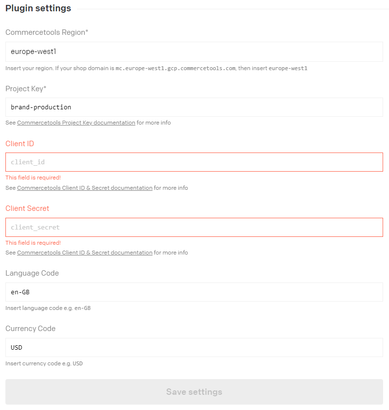

# DatoCMS Commercetools product plugin

A plugin that allows users to search and select Commercetools products.

## Configuration

Please specify your Commercetools settings on the plugin global settings. Links to documentation for each setting are provided under each input field:

This plugin use the GraphQL provided by Commercetools. The languageCode and currencyCode is a part of the query so make sure these match your Commercetools setup.
